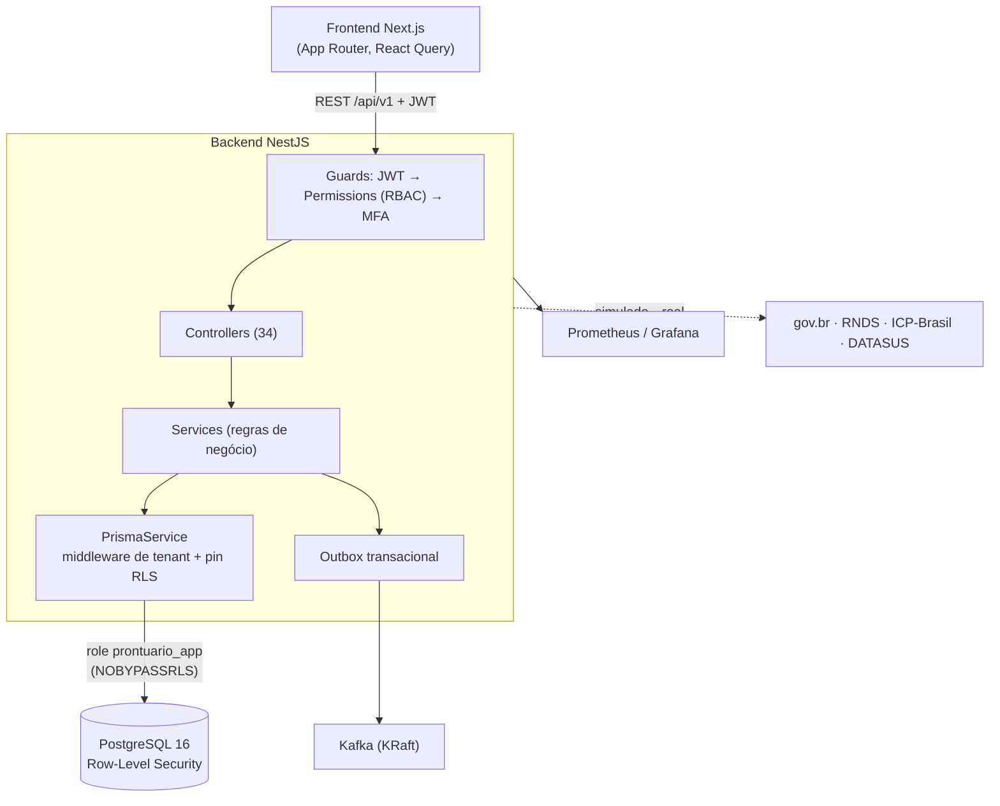

# SNPE — Visão Geral e Arquitetura

> **SNPE** — Sistema Nacional de Prontuário Eletrônico (Prontuário Eletrônico
> Hospitalar / PE-E2). Backend NestJS + Prisma sobre PostgreSQL; frontend
> Next.js/React. Multi-tenant por hospital, com isolamento reforçado por
> Row-Level Security, auditoria WORM e integrações oficiais do SUS.

Este documento é o **hub** da documentação. Para detalhes, veja o
[índice](#9-índice-da-documentação).

---

## 1. O que é

Prontuário eletrônico hospitalar de âmbito nacional, desenhado para operar como
plataforma **multi-hospital** (cada hospital é um *tenant*), cobrindo o ciclo
clínico completo — do pronto-socorro à alta — e as obrigações de saúde pública
(vigilância, regulação, epidemiologia) e de conformidade (LGPD, auditoria,
retenção legal). As integrações com o governo federal (gov.br, RNDS, ICP-Brasil)
são **plugáveis**: rodam em modo simulado por padrão e viram reais via
credenciais/flags (ver [HOMOLOGACAO.md](HOMOLOGACAO.md)).

## 2. Stack técnica

| Camada | Tecnologia |
|---|---|
| Backend | NestJS (TypeScript), arquitetura modular |
| ORM / DB | Prisma + PostgreSQL 16 |
| Frontend | Next.js (App Router) + React + React Query |
| Auth | JWT (access/refresh) + MFA TOTP + gov.br OIDC |
| Eventos | Outbox transacional + Kafka (KRaft); fallback logging |
| Observabilidade | Prometheus + Grafana; logs estruturados JSON |
| Isolamento | Middleware Prisma (app-layer) + PostgreSQL RLS |
| Deploy | Docker (imagem única a partir da raiz do monorepo) |

## 3. Arquitetura em camadas

Fluxo de uma requisição autenticada: `JwtStrategy` (revalida o usuário e o
`hospitalId` no banco) → `PermissionsGuard` (RBAC) → `MfaGuard` → controller →
service → `PrismaService`, que injeta o escopo de tenant e "pina" a conexão com
o GUC de RLS. Nenhum service precisa filtrar por hospital manualmente.

## 4. Mapa de módulos

O `AppModule` importa ~40 módulos. Agrupados por domínio:

- **Identidade & acesso**: `auth` (JWT+MFA), `usuarios`, `perfis`, `hospitals`,
  `auth/govbr` (OIDC).
- **Paciente & MPI**: `pacientes`, `mpi/cidadaos` (índice mestre por CPF/CNS).
- **Fluxo clínico**: `triage`, `pronto-socorro`, `encounters`, `internacao`,
  `exames`, `cirurgia`, `prescricao-hospitalar`, `prescriptions`, `prontuarios`.
- **Saúde pública**: `vigilancia` (SINAN), `regulacao`, `epidemiologia`.
- **Documentos & interop**: `pdf`, `documentos` (assinatura+verificação),
  `rnds` (FHIR R4), `fhir`, `terminologia` (CID-10/RENAME/CBO/SIGTAP/CNES).
- **Dados & conformidade**: `export`, `csv` (import), `backup`, `reports`,
  `auditoria` (hash-chain WORM), `lgpd`, `locks`.
- **Infra**: `outbox`, `internal/consistency` (monitor), `metrics`.

Detalhe de rotas e permissões: [API.md](API.md).

## 5. Modelo de dados (agregados principais)

~55 modelos Prisma. Os agregados centrais:

- **Tenant/identidade**: `Hospital`, `Unidade`, `Setor`, `Leito`, `Usuario`,
  `Perfil`, `Medico`, `Regional`.
- **Paciente**: `Paciente` (por hospital), `Cidadao` + `CidadaoIdentityKey`
  (identidade nacional MPI).
- **Clínico**: `Atendimento`, `Triagem`, `AtendimentoPS`, `Prontuario`,
  `Internacao` + `EvolucaoInternacao`, `ExameSolicitado` + `TipoExame`,
  `Cirurgia` + `SalaCirurgica`, `PrescricaoHospitalar` + `ItemPrescricaoHosp` +
  `AdministracaoMed`, `VacinaAplicada` + `Vacina`.
- **Saúde pública**: `NotificacaoCompulsoria`, `Encaminhamento`, `AIH`, `APAC`.
- **Conformidade/infra**: `Auditoria` (WORM), `DocumentoAssinado`,
  `ConsentimentoLgpd`, `EnvioRnds`, `ImportLog`, `OutboxEvent`,
  `ProcessedEvent`, `ResourceLock`, `AggregateSequence`.

## 6. Modelo de tenant e segurança (defesa em profundidade)

O isolamento multi-tenant tem **duas camadas** independentes — se uma falhar, a
outra segura:

1. **App-layer** (`PrismaService` + `shared/tenant/tenant-guard.ts`): um
   middleware Prisma injeta `hospitalId` automaticamente em toda operação
   (read/create/update/delete; `findUnique` vira `findFirst` escopado) para os
   modelos em `TENANT_MODELS`. Sem `hospitalId` no contexto → operação bloqueada
   (403).
2. **Banco (RLS)** (`migrations/*_rls_*`): o PostgreSQL enforça o isolamento via
   *Row-Level Security*. O app conecta como a role **`prontuario_app`**
   (`NOBYPASSRLS`, não-dona); cada leitura/escrita roda numa transação curta com
   `SET LOCAL app.hospital_id`. Fail-closed: sem o GUC, nenhuma linha casa.
   Migrations/seed rodam na role **dona** (`prontuario`), que ignora RLS.

**Modelos cobertos**: `Paciente`, `Atendimento`, `Triagem`, `Prescricao`,
`Prontuario`, `NotificacaoCompulsoria`, `Encaminhamento`, e — desde a defesa em
profundidade recente — `Internacao`, `ExameSolicitado`, `VacinaAplicada`,
`Cirurgia`. **SuperAdmin** é o único perfil que atravessa tenants, e só para
**leitura** (GUC `app.superadmin`), sempre auditada; escrita cross-tenant segue
barrada pelo `WITH CHECK`.

Camadas complementares de segurança: RBAC por permissão (ver §7), MFA TOTP,
auditoria **WORM** com hash-chain, JWT com segredos ≥32 chars em produção,
rate limiting, e "break-the-glass" auditado no LGPD. Ver [SECURITY.md](SECURITY.md)
e [BASE-LEGAL-LGPD.md](BASE-LEGAL-LGPD.md).

## 7. RBAC — perfis e permissões

20 permissões atômicas (`recurso:ação`) agrupadas em perfis. Resumo:

| Perfil | Permissões (resumo) |
|---|---|
| **SUPER_ADMIN** | `admin:full`, `hospital:manage` — único cross-tenant (leitura) |
| **ADMINISTRADOR** | `admin:full` (escopado ao próprio hospital) |
| **MEDICO** | leitura clínica + escrita de encounter/prescrição/internação/PS/exame/cirurgia + reports/vigilância/regulação |
| **ENFERMEIRO** | triagem, PS, exame, internação, administração de medicamento, vigilância |
| **GESTOR** | leitura clínica + auditoria + reports + decisão de regulação |
| **FARMACEUTICO** | `patient:read` |
| **RECEPCAO** | `patient:read`, `patient:create` |

O guard lê o perfil **revalidado do banco** (não confia em flag do cliente).
Enum e mapa completos: `backend/src/shared/rbac/permissions.ts`.

## 8. Eventos, consistência e integrações

- **Outbox transacional**: eventos de domínio são gravados na mesma transação da
  mutação e publicados por um worker (`OutboxWorker`) — entrega ao menos uma vez,
  idempotência por `ProcessedEvent`. Backbone: **Kafka (KRaft)**; sem broker, cai
  no `LoggingEventBus`.
- **Monitor de consistência** (`internal/consistency`): verifica invariantes
  (ordem causal da auditoria, quarentena de órfãos) — on-demand e periódico.
- **Integrações oficiais** (plugáveis, ver [HOMOLOGACAO.md](HOMOLOGACAO.md)):
  gov.br (OIDC), ICP-Brasil (assinatura+QR), RNDS (bundles FHIR R4), terminologias
  DATASUS (CID-10, RENAME, CBO, SIGTAP, CNES).

## 9. Índice da documentação

| Documento | Conteúdo |
|---|---|
| **VISAO-GERAL.md** (este) | Arquitetura, módulos, tenant/segurança, RBAC |
| [API.md](API.md) | Referência de todos os endpoints REST + permissões |
| [DEPLOY.md](DEPLOY.md) | Runbook: envs, migrations, RLS, backup, observabilidade |
| [ARQUITETURA-SNPE.md](ARQUITETURA-SNPE.md) | Arquitetura-alvo para escala nacional |
| [SECURITY.md](SECURITY.md) | Postura de segurança e hardening |
| [BASE-LEGAL-LGPD.md](BASE-LEGAL-LGPD.md) | Operação → base legal LGPD |
| [HOMOLOGACAO.md](HOMOLOGACAO.md) | Credenciamento das integrações oficiais |
| [OPERACOES.md](OPERACOES.md) | Higiene de build (anti-404 fantasma) + CSV |
| [VERSIONING.md](VERSIONING.md) | Versionamento da API |
| [FASE5-EXPORT-BACKUP.md](FASE5-EXPORT-BACKUP.md) · [FASE5-VALIDACAO-E2E.md](FASE5-VALIDACAO-E2E.md) | Export/backup e validação E2E |
